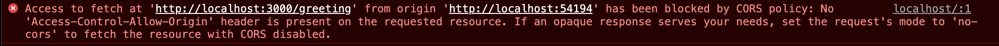

# Cross Origin Communication

## Guidance

There are two patterns that the team is familiar with when dealing with Cross Origin Communication.  Those are Cross Origin Resource Sharing(CORS) and using a Proxy server.

## Cross Origin Resource Sharing (CORS)

By default, browsers assume that your backend server doesn't want to share its resources with a front-end that it doesn't know about.

You might have seen this error in the browsers dev console:

We have a [small and simple application](https://github.com/nodeshift-blog-examples/cors-ref-arch-demo) that demonstrates getting a CORS error and how to fix it.

However, there are certain situations where your backend might want to be accessible to a front-end application, like a website, CORS should be enabled.  Listed below are some situations, where you might want to make sure CORS is enabled

### External APIs

When developing a backend with a public API and you would like to control access to certain resources and how they are used, CORS should be enabled.

**note: When enabling CORS, it is important to limit those methods and headers your application allows to prevent unwanted actors from accessing resources they shouldn't be accessing.**

### Access to Multiple Environments

As part of the development and testing process of a front-end application, you might want to test against multiple environments, like staging and pre-productions, before pushing to production.  If CORS is not enabled on each of these backends, the front-end application will fail to communicate with them.

The team recommends using environment variables to control allowed origin hosts.  This allows keeping CORS enabled locally, but provides different values for each environment.

## Proxy Server

The team also has experience doing cross origin communication using a Proxy Server.

This is helpful when you can't make requests directly from your front-end application to the API server.  Your front-end application might only be able to make requests to its host server.  The host server would then proxy those requests to the target API server.

## Recommended Components

[cors](https://www.npmjs.com/package/cors) is a node.js package for providing a Connect/Express middleware that can be used to enable CORS with various options.

Most web frameworks, like express.js, have [similar modules](https://www.npmjs.com/search?q=cors) to help easily enable and manage CORS requests

## Further Reading

* [cors](https://www.npmjs.com/package/cors)

* [CORS module search on npm](https://www.npmjs.com/search?q=cors)

* [CORS on mdn](https://developer.mozilla.org/en-US/docs/Web/HTTP/CORS)
